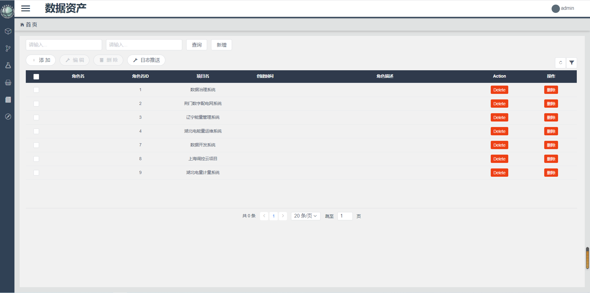

## install
```
npm install curdlayout -S
```

## Quick Start

```js
import Vue from 'vue'
import curdLayout from 'curdlayout'
 
Vue.use(curdLayout)
```

## CURD 布局组件

>封装业务相似代码，减少重复编码

最终目的时通过简单的几项配置，完成经常遇到的curd的表格业务

#### 1.使用案例
```js

<template>
  <CurdView
    :tableOptions="tableOptions"
    @on-selection-change="onTableselected"
    @on-change="getInputParams"
    @on-row-dblclick="rowDblclick"
    @on-row-click="rowClick"
  >
    <template v-slot:tool>
      <Button type="default">新增</Button>
    </template>
    <template v-slot:pannel>
      <Button type="default" shape="circle" icon="ios-build">日志推送</Button>
    </template>
    <template v-slot:action="Props">
      <Button type="error" size="small" @click="remove(Props)">Delete</Button>
    </template>
    <template v-slot:operation="Props">
      <Button type="error" size="small" @click="remove(Props)">删除</Button>
    </template>
  </CurdView>
</template>

<script>
const tableOptions = {
  pageSize: 20,
  dataUrl: "/data-project-management-service/project/getProject",
  param: {},
  columns: [
    { type: "selection", width: 60, align: "center" },
    { key: "creator", title: "角色名", align: "center", width: 180 },
    { key: "id", title: "角色名ID", align: "center", width: 180 },
    { key: "projectName", title: "项目名", align: "center", width: 180 },
    { key: "createDate", title: "创建时间", align: "center", width: 180 },
    { key: "description", title: "角色描述", align: "center" },
    { title: "Action", slot: "action", width: 150, align: "center" },
    { title: "操作", slot: "operation", width: 150, align: "center" }
  ],
  searchDynamic: [
    { name: "name", type: "text", span: 6, label: "角色名" },
    { name: "description", label: "角色描述", span: 6, type: "text" }
  ]
};
import CurdView from "@/components/CurdView/index";
export default {
  data() {
    return {
      tableOptions
    };
  },
  components: { CurdView },
  methods: {
    onTableselected(selection) {
      console.log(selection);
    },
    getInputParams(params) {
      console.log(params);
    },
    rowDblclick(selection) {
      console.log(selection);
    },
    rowClick(selection) {
      console.log(selection);
    },
    remove(obj) {
      alert(obj.rowData.index);
    }
  }
};
</script>
<style lang='less'>
</style>
```
显示如下(样式颜色可能会有不一样):

#### 2. API

 > CurdView props 

 
 ```js
 tableOptions:{ //Object类型，包含Table组件所有属性的集合，为空时不显示tbale布局
    showPanelTool:true, // Boolean类型，是否显示变革上方，新增，修改，删除按钮,默认为true显示，false不显示
    pageAlign:'center', //String类型,分页布局位置，默认center，可选，left，right
    tableSize:'small', //String类型,表格尺寸，可选值为 large、small、default 或者不填
    pageSize:10, //Number类型,分页条数
    showOpratingToolbar:true, //Boolean类型，是否显示表格操作栏，true为显示。false为不显示
    showSettingToolbar:true, //Boolean类型，是否显示表格操作栏，true为显示。false为不显示
    showPage:true, // Boolean类型，是否显示分页，默认为true显示，false不显示
    lazy:false, // Boolean类型，初始化时，时候调用业务接口,默认false
    columns:[], // Arrary类型,表格列的配置描述，具体参照iView文档
    dataUrl:'',//String类型,表格列表查询接口地址,
    param:{}, //Object类型,dataUrl接口的参数,默认参数包含currentPage,pageSize,相同参数会自动合并，key值为参数名，vulue为参数值
    height:400, //Number | String类型，表格高度，单位 px，设置后，如果表格内容大于此值，会固定表头
    searchDynamic:[], //Arrary类型,是一个包含查询条件得集合，具体可看使用案例，name属性及为v-model绑定属性。也应和查询参数名称保持一致
 }
 treeOptions：{ //Object类型，包含Tree组件所有属性的集合，为空时不显示tree布局
    dataUrl:'',//String类型,表格列表查询接口地址,
    param:{}, //Object类型,dataUrl接口的参数，无默认参数，key值为参数名，vulue为参数值
    renderFunc:Function ,// Function类型,自定义tree方法，应返回一个render函数
 }
//  暂时只有这么多，慢慢完善
 ```
 > CurdView events 

```js
on-selection-change // 在多选模式下有效，只要选中项发生变化时就会触发,返回值selection：已选项数据
on-row-dblclick // 双击表格ROW时触发,返回值selection：已点击数据
on-row-click // 单击表格ROW时触发,返回值selection：已点击数据
on-change // 查询条件发生改变时触发，返回值params:查询条件得集合
on-select-change // 选中树节点时的方法，返回Object 包含当前已选中的节点数组、当前项，并触发table查询操作
```

 >Slot 插槽

提供自定义功能
* 查询条件操作栏自定义,名称为tool得具名插槽,如下,添加一个**新增**按钮
```js
 <template v-slot:tool>
    <Button type="default">新增</Button>
</template>
```
显示如下(样式颜色可能会有不一样):


* 表格操作按钮，除了添加，编辑，删除外，可自定义其他内容，名称为panel得具名插槽,如下,添加一个**日志推送**按钮

```js
<template v-slot:pannel>
    <Button type="default" shape="circle" icon="ios-build">日志推送</Button>
</template>
```
显示如下(样式颜色可能会有不一样):


* table的**Render 写法不变**，slot插槽主要使用了作用域插槽，`v-slot:action="Props"`,`action`即为插槽name，和clunms项的`slot: 'action'`必须保持一致(可看例子),
`Props`当前行数据 `row`，当前行序号 `index`。
>因为进行了封装，所以table自定义列模板和iView有点不一样，但是**Render 写法不变**，可按照iView官方文档书写，
```js
 <template v-slot:action="Props">
    <Button type="default" size="small" @click="getRow(Props)">刷新</Button>
 </template>
 <template v-slot:operation="Props">
    <Button type="error" size="small" @click="getRow(Props)">删除</Button>
 </template>
```